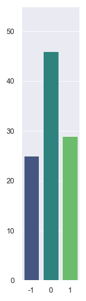
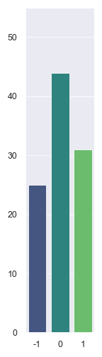
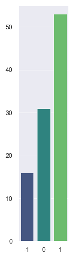
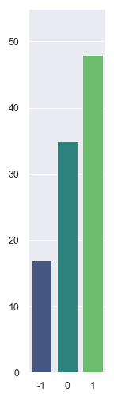
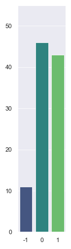

# Twitter Sentiment Analysis
---


## Background

In this information age, every person on the internet can find millions of articles, posts, and discussions within a second on any platform with search engine capabilities. With technological advancement, people are now able to dissect the sentiments of thousands of texts based on the topic of their interest using Natural Language Processing (NLP).

In this case, we will analyze the sentiments of the general population on the 5 big technology companies; Apple (APPL), Microsoft (MSFT), Amazon (AMZN), Facebook (FB), and Tesla (TSLA).

| Selected 5 Companies for Sentiment Analysis |
| --------------------------------------- |
|  |

To analyze the sentiment of these 5 companies, we must accomplish the following tasks:

1. [Requesting Text Data Using Twitter API](#Requesting-Text-Data-Using-Twitter-API)
2. [Data Storage Processing](#Data-Storage-Processing)
3. [Sentiment Analysis](#Sentiment-Analysis)
4. [Sentiment Visualization](#Sentiment-Visualization)

## File

1. [Codes for Twitter Sentiment Analysis](Codes/sentiment_analysis.ipynb)

---
### Requesting Text Data Using Twitter API

To request tweets from Twitter, we will need to [create a Twitter developer account](https://developer.twitter.com/en) first. Then, create an app that will provide the user with a consumer key, a consumer secret key, an access token, and an access token secret key. Create an environment file to store the keys. Now, we can start requesting tweets from Twitter using the Twitter API.

##### Step 1: Import Libraries

```python
    import os
    from dotenv import load_dotenv
    import tweepy
```

##### Step 2: Load Twitter API and Access Tokens

Security of your API keys and Access tokens are the most important step. Do not expose your keys and tokens. Use an environment file to store and os library to securely load the keys and tokens. First, load the environment file using the following code.

```python
    load_dotenv()
```
If the output is True, proceed to the following codes.

```python
    # Get the keys from the environment file
    twitter_api_key = os.getenv("twitter_api")
    twitter_secret_key = os.getenv("twitter_api_secret")
    twitter_access_token_key = os.getenv("twitter_access_token")
    twitter_access_token_secret_key = os.getenv("twitter_access_token_secret")

    # Checking if the keys return str or Nontype. str means success.
    print(type(twitter_api_key))
    print(type(twitter_secret_key))
    print(type(twitter_access_token_key))
    print(type(twitter_access_token_secret_key))
```

##### Step 3: Authenticate API Keys and Access Tokens

Tweepy has two authentication methods to authenticate keys. Visit [Tweepy website](http://docs.tweepy.org/en/latest/auth_tutorial.html#introduction) for more authentication information. For simplicity's sake, we will use the OAuthHandler method for authentication.   

```python
    auth = tweepy.OAuthHandler(twitter_api_key, twitter_secret_key)
    auth.set_access_token(twitter_access_token_key, twitter_access_token_secret_key)
    api = tweepy.API(auth)
```

##### Step 4: Request Tweets

Define a query to pull related tweets from Twitter. Since retweets will not accurately describe the recent sentiment of the tweets, we can use "-filter:retweet" to exclude the retweets. You can visit Twitter Developer Website for [more Search-Operator rules](https://developer.twitter.com/en/docs/twitter-api/v1/rules-and-filtering/search-operators).

```python
    results = api.search(q= "Sample -filter:retweets", lang = "en", count= 100)
```

### Data Storage Processing

##### Step 1: Formatting

The requested tweets from Twitter will be provided with a Status class. However, we must store the results in JSON format, because we will be creating a Data Frame for the tweets afterward.

```python
    # Interate results in Json to prepare for a dataframe creation.
    json_data = [result._json for result in results]

    # Create dataframe from the json format
    df = pd.json_normalize(json_data)
```

##### Step 2: Simplified Data Frame

Twitter will provide a user with a variety of information on a single tweet. Therefore, we need to decide what information we want to use. In this case, we can create a data frame with the date of creation and the text of the tweets. The text will be useful for sentiment analysis.

```python
    # Get Date and Text Columns
    tweets_df = df[["created_at", "text"]]

    # Sample 5 dataframe rows
    tweets_df.head(5)
```

### Sentiment Analysis

For sentiment analysis, we can use the Natural Language Toolkit (NLTK) library. NLTK provides a Vader sentiment score and intensity analyzer that we can use to calculate the positive, negative, and neutral sentiments of each company.

##### Step 1: Set up Sentiment Analyzer

```python
    # Import Natural Language Toolkit Library
    import nltk
    from nltk.sentiment.vader import SentimentIntensityAnalyzer
    
    # Initialize the VADER sentiment analyzer
    analyzer = SentimentIntensityAnalyzer()
```

##### Step 2: Analyze Sentiment

To set the definitive sentiment of a tweet, we must generalize the sentiment of the tweet. For example, if the tweet has more negative sentiment, we can give a score of -1 for the tweet sentiment. 

```python
    # Sentiment calculation based on compound score
    def get_sentiment(score):
        """
        Calculates the sentiment based on the compound score.
        """
        result = 0  # Neutral by default
        if score >= 0.05:  # Positive
            result = 1
        elif score <= -0.05:  # Negative
            result = -1 
        return result
```

Then, we can create a dictionary of lists for the compound, negative, neutral, positive, and general tweet sentiments to create respective columns to append the sentiment values calculated with the Vader sentiment analyzer.

```python
    # Sentiment scores dictionaries
    tweet_sent = {
        "tweet_compound": [],
        "tweet_pos": [],
        "tweet_neu": [],
        "tweet_neg": [],
        "tweet_sent": [],
    }
    
    # Get sentiment for the tweets
    for index, row in tweets_df.iterrows():
        try:
            # Sentiment scoring with VADER
            tweet_sentiment = analyzer.polarity_scores(row["text"])
            tweet_sent["tweet_compound"].append(tweet_sentiment["compound"])
            tweet_sent["tweet_pos"].append(tweet_sentiment["pos"])
            tweet_sent["tweet_neu"].append(tweet_sentiment["neu"])
            tweet_sent["tweet_neg"].append(tweet_sentiment["neg"])
            tweet_sent["tweet_sent"].append(get_sentiment(tweet_sentiment["compound"]))
    
        except AttributeError:
            pass
```
Finally, we can create a tweet_sentiment data frame from the dictionary of lists we appended the sentiment values. Then, we can join the original data frame and the tweet sentiment data frame to create one data frame that provides the dates, texts, and sentiment scores.  

```python
    # Attaching sentiment columns to the News DataFrame
    tweet_sentiment_df = pd.DataFrame(tweet_sent)
    tweets_df = tweets_df.join(tweet_sentiment_df)
    
    tweets_df.head()
```
### Sentiment Visualization

The Bar plot is a great visualization tool to show which sentiment is the most prevalent on Twitter for each selected company. -1 represents Negative sentiment. 0 represents Neutral sentiment. 1 represents Positive sentiment.

| Apple | Microsoft | Amazon | Facebook | Tesla |
| ----- | --------- | ------ | -------- | ----- |
|  |  |  |  |  | 
 
The above bar charts show the most positive sentiment for Amazon and the most negative sentiment for Apple on January 11, 2021. The users may need to be aware of the limitation of such analysis because basic Twitter API allows 100 tweets for each API query calls. The sentiment may not reflect the overall sentiment of the company. However, Twitter provides Enterprise Twitter API for a price for the user to request public historical tweets without limitation. Without payment, the most we can do is to gain insight into the sentiment of the company on a glimpse of a moment on Twitter based on 100 tweets.

---
### Created by

__Dana K Lain__, Profile: [LinkedIn](www.linkedin.com/in/dana-kyine-lain)
